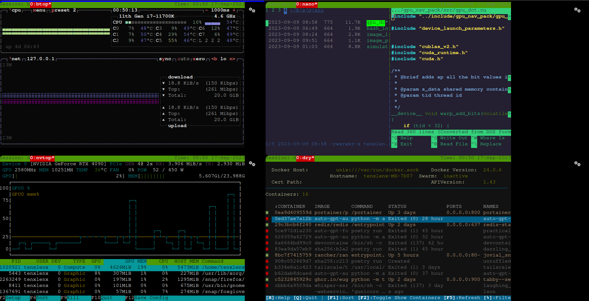

# Flask-based Dashboard



## Description

This project is a web-based dashboard built with Flask. It hosts various system monitoring tools like `btop`, `nvtop`, `nnn`, and `dry`, all embedded within iframes for easy and centralized monitoring. 
The dashboard also provides a simple top navigation bar for easy access to different pages and is set up with SSL for secure access.
You need to have your own server, but I suggest you use tailscale for a private vpn so you can have your secure https domains. You just have to switch the ones I used in the HTML files, will probably remove them in a later release.

## Features

- Embedded system monitoring tools: `btop`, `nvtop`, `nnn`, `dry`
- Simple and responsive UI
- Top navigation bar for easy access to different modules
- Secure communication via SSL
- Cross-Origin Resource Sharing (CORS) settings enabled

## Requirements

- Python 3.x
- Flask
- `htop`, `btop`, `dry`, `cgroup-tools`, `nvtop`, `nnn` packages
- SSL certificate and key files - I use tailscale for this which is super easy to use
- Command-line arguments for server details (user, password, host, port)

## Installation and Running

1. Clone the repository.
    ```bash
    git clone https://github.com/tenxlenx/dashboard_stream.git
    ```
2. Navigate into the project folder and install the required Python packages. 
    ```bash
    cd dashboard_stream
    pip install Flask
    ```
3. Run the Flask app using the command-line arguments. This expects you to have a .cert and .key file with the name of <domain-name>.crt and <domain-name>.key 
    ```bash
    python app.py --user [USER] --password [PASSWORD] --host [HOST] --port [PORT]
    ```
    Replace `[USER]`, `[PASSWORD]`, `[HOST]`, and `[PORT]` with your server details.

5. Access the dashboard on `https://[HOST]:[PORT]`.

## Contribution

Feel free to contribute to this project by opening issues or submitting pull requests.
